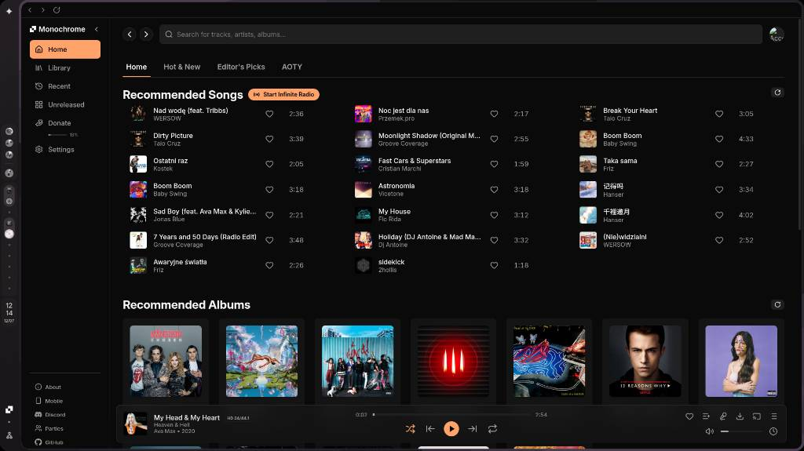
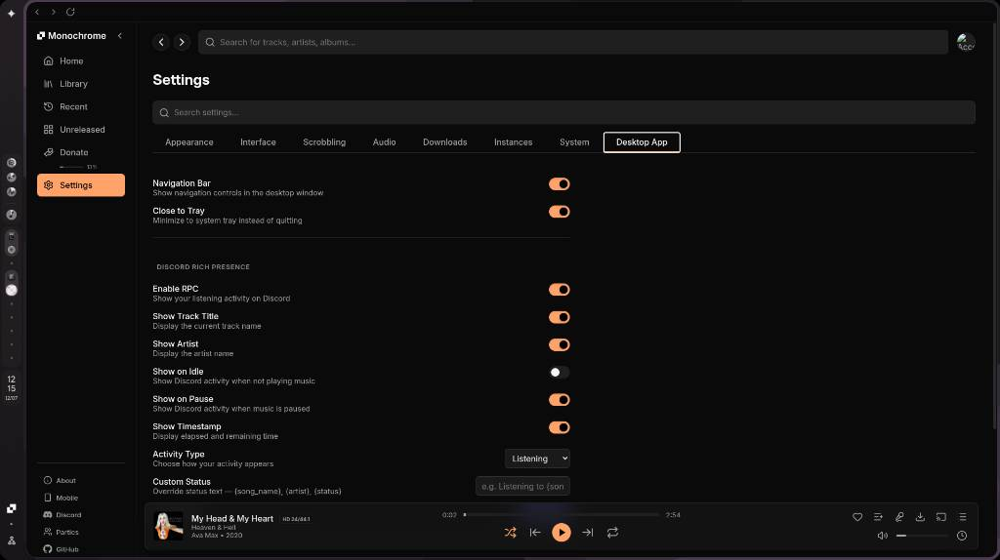

<p align="center">
  
</p>

<h1 align="center">Monochrome Player</h1>

<p align="center">
  <strong>Desktop wrapper for monochrome.tf with Discord Rich Presence.</strong>
</p>

<p align="center">
  <a href="#features">Features</a> -
  <a href="#screenshots">Screenshots</a> -
  <a href="#installation">Installation</a> -
  <a href="#building">Building</a> -
  <a href="#configuration">Configuration</a>
</p>

<p align="center">
  
  
  
</p>

A minimal, frameless Electron shell around the Monochrome music player web app.
Adds Discord Rich Presence, system tray controls, media keys, and a native settings
page injected directly into the Monochrome UI.

---

## Features

- **Frameless window** with a custom navigation bar (back, forward, reload, minimize, maximize, close). Window controls auto-hide on tiling window managers.
- **Discord Rich Presence** -- fully customizable activity display with support for custom details, buttons, small/large images, variable placeholders (`{song_name}`, `{artist}`, `{status}`), and per-element toggles.
- **System tray** with close-to-tray support, RPC toggle, and nav bar visibility control.
- **Media keys** -- play/pause, next, previous (requires D-Bus on Linux).
- **Injected settings tab** -- a "Desktop App" tab inside Monochrome's own settings page for toggling Electron features without leaving the app.
- **Auto-hiding automation** -- disables `navigator.webdriver` and overrides the User-Agent to avoid detection by Cloudflare challenges.
- **Custom protocol handler** -- registers `monochrome-player://` URI scheme.
- **Session persistence** -- browser cache, cookies, and localStorage survive restarts.

## Screenshots

<p align="center">
  
  <br>
  <em>Main window with navigation bar</em>
</p>

<p align="center">
  
  <br>
  <em>Injected Desktop App tab inside Monochrome settings</em>
</p>

## Installation

### Linux

<details>
<summary> Arch Linux</summary>

Download the `monochrome-player-*.pacman` package from the [latest release](https://github.com/kmmiio99o/Monochrome-PC/releases/latest) and install with:

```
sudo pacman -U monochrome-player-*.pacman
```

</details>

<details>
<summary> Debian / Ubuntu</summary>

Download the `monochrome-player_*.deb` package from the [latest release](https://github.com/kmmiio99o/Monochrome-PC/releases/latest) and install with:

```
sudo dpkg -i monochrome-player_*.deb
```

</details>

<details>
<summary> Fedora</summary>

Download the `monochrome-player-*.rpm` package from the [latest release](https://github.com/kmmiio99o/Monochrome-PC/releases/latest) and install with:

```
sudo rpm -i monochrome-player-*.rpm
```

</details>

<details>
<summary> Nix / NixOS</summary>

```
nix run github:kmmiio99o/Monochrome-PC
```

Or add to your flake:

```nix
{
  inputs = {
    monochrome-player.url = "github:kmmiio99o/Monochrome-PC";
  };
}
```

</details>

<details>
<summary> openSUSE</summary>

Download the `monochrome-player-*.rpm` package from the [latest release](https://github.com/kmmiio99o/Monochrome-PC/releases/latest) and install with:

```
sudo zypper install monochrome-player-*.rpm
```

</details>

<details>
<summary> AppImage (any distro)</summary>

Download `monochrome-player-*.AppImage` from the [latest release](https://github.com/kmmiio99o/Monochrome-PC/releases/latest), make it executable, and run:

```
chmod +x monochrome-player-*.AppImage
./monochrome-player-*.AppImage
```

</details>

### Windows

<details>
<summary>⊞ Windows</summary>

Download the `monochrome-player-Setup-*.exe` (NSIS installer) or `monochrome-player-*.portable.exe` (portable) from the [latest release](https://github.com/kmmiio99o/Monochrome-PC/releases/latest).

- **Installer**: Run the `.exe` and follow the setup wizard.
- **Portable**: Extract and run `Monochrome Player.exe`.

</details>

### macOS

<details>
<summary> macOS</summary>

Download `monochrome-player-*.dmg` from the [latest release](https://github.com/kmmiio99o/Monochrome-PC/releases/latest), open it, and drag the app to your Applications folder.
</details>

### From source (all platforms)

<details>
<summary> Build from source</summary>

Requires [Bun](https://bun.sh) and [Node.js](https://nodejs.org) 22+.

```
git clone https://github.com/kmmiio99o/Monochrome-PC
cd Monochrome-PC
bun install
bun run start
```

</details>

## Building

<details>
<summary> Linux</summary>

```
bun run build --linux
```

Output formats: `.deb`, `.rpm`, `.AppImage`
</details>

<details>
<summary>⊞ Windows</summary>

```
bun run build --win
```

Output formats: `.exe` (NSIS installer), `portable.exe`
</details>

<details>
<summary> macOS</summary>

```
bun run build --mac
```

Output formats: `.dmg`, `.zip`
</details>

<details>
<summary> All platforms</summary>

```
bun run build
```

Builds for the current platform. Output goes to `dist/`.
</details>

## Usage

- **Navigation bar** -- use the back/forward/reload buttons to navigate Monochrome. Drag the title bar area to move the window.
- **Settings** -- open Monochrome's settings page and click the "Desktop App" tab.
- **Discord RPC** -- enable in the Desktop App settings tab. Customize details, buttons, and images from the Advanced section.
- **Media keys** -- use your keyboard's play/pause, next, and previous buttons.
- **Close to tray** -- closing the window minimizes to the system tray. Quit from the tray menu.

## Configuration

Settings are stored in `rpc-settings.json` inside the Electron user data directory
(`~/.config/monochrome-player/` on Linux).

The version is managed centrally in the `VERSION` file. Running `bun run start`
automatically syncs it to `package.json`, `flake.nix`, `PKGBUILD`, and `.SRCINFO`
via `bun run sync-version`.

## License

MIT
